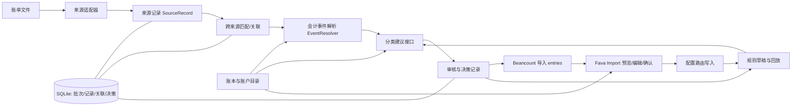

# 软件架构方案

**版本：0.1（预研稿）**  
**日期：2026-09-26**

> **2026-09-28 方向更新（dev）：** 分类主路径以 [研究方向](research-direction.md) 为准。本文保留来源记录、跨来源关联、人工审核和专用文件写入。其中“规则优先于 ML、ML 优先于 LLM”，以及“核心账务生成不能依赖 LLM”里针对语义分类的部分，不再指导实现。金额、事件类型和复式 posting 仍由确定性代码生成。

## 1. 目标与边界

架构首先保证导入过程可重复、可审计、可撤回。核心账务生成不能依赖 ML/LLM 的不可预测输出；解析、归类、审核和 Beancount 渲染分别隔离。

首期按单用户、本机、人工下载账单设计。应用不存储银行密码，不主动连接支付/银行 API，不将主账本作为写入目标。

## 2. 逻辑组件



## 3. 模块框架与复用边界

### 3.1 模块契约

模块之间只依赖领域数据契约，不直接依赖其他模块的数据库表或 UI。来源插件可替换，关联器、事件解析器、分类器和导出器可以独立演进。应用服务负责编排它们，不在编排层重新实现业务规则。

| 模块 | 输入 -> 输出 | 职责边界 | 可直接复用的成熟代码/方案 | 替换边界 |
| --- | --- | --- | --- | --- |
| `SourceAdapter` 来源适配器 | 文件 + 来源配置 -> `SourceBatch[SourceRecord]` | 识别格式、解析、保留原文与定位信息；不作最终分类、不合并其他来源、不写账本。 | 首选验证 `china_bean_importers` 中对应 Python importer；实现/包装为 Beangulp `Importer`，由 Fava Import 配置发现和调用。`double-entry-generator` 的 provider/parser 适合作为格式参考。 | Beangulp importer 是账本接入边界；adapter 的领域输出仍独立于 Beancount Directive，避免 Fava UI/schema 成为内部模型。 |
| `Reconciler` 来源关联器 | 来源记录 + 账本已知记录 -> 匹配候选/已确认关联 | 提出同一经济活动的候选关联，保存证据；未经确认不删除或覆盖来源记录。 | Beangulp hooks 可用于跨 importer 处理提取结果；Fava 文档支持 Beangulp hook tuple。`beancount-import` 的候选匹配/合并 UI 是强参考，但不作为必选底座。 | 关联算法版本化；候选和用户确认的 link 用稳定 ID 存储。验证 hook 生命周期是否满足多批次、多来源事件解析需求。 |
| `EventResolver` 会计事件解析器 | 一条或多条已关联来源记录 -> `AccountingEvent` | 判断支出、收入、转账、信用卡还款、退款等经济事件，明确来源账户/金额及未决 contra account；把多个来源证据整合成事件但保留出处。 | 这是产品核心领域逻辑，目前没有核实到可直接覆盖目标场景的成熟库；借鉴 `double-entry-generator` 的交易方向/规则和 `bill2bean` 的 transfer/refund 案例。 | 事件类型和证据引用是稳定契约；具体解析规则可按账单格式和用户习惯替换。 |
| `SuggestionProvider` 分类建议器 | 待分类事件 + 账户目录 + 确认历史 -> 0..N `Suggestion` | 提供账户/分录候选及理由、来源、规则/模型版本和置信度；不保存最终用户决定、不写 Beancount。 | 用户规则可借鉴 `double-entry-generator`；本地 ML 可适配 `smart_importer`；模板条件可参考 `beanhub-import`。 | provider 可配置/替换；结果统一为建议契约。停用 ML/LLM 后规则和人工审核仍可工作。 |
| `ReviewWorkflow` 审核流程 | 会计事件 + 建议 -> 用户确认的 `Decision` | 提供人工编辑、接受、跳过、关联/拆分等动作；记录最终决策。人工 GUI 是此模块的界面，不是分类算法。 | 首选 Fava Import 页面：上传文件、选择 importer、查看提取结果、编辑 entries、保存非重复 entries；Fava 支持 Beangulp importers 与 hooks。 | 先用标准 Import 页面承载可表达为 Transaction/Balance/Note 的审核；若需要原始 SourceRecord 多候选合并、任意事件拆分或规则草稿管理，再做 Fava extension/独立 UI，不依赖不稳定的 Fava 内部 API。 |
| `BeancountExporter` 导出器 | 已确认 `Decision` + 输出模板 -> Beancount entries/text | 只渲染已确认事件，管理账户/metadata/tags/文件路由；不重新分类、不做跨来源匹配。 | 生成符合 Beangulp/Fava 预期的 Beancount directives；Fava 页面提供提取预览/编辑/保存，Beancount parser 作校验。`beanhub-import` 适合参考声明式输出与幂等路由。 | 输出和审核分离；配置 Fava `insert-entry` 路由到专用文件并实测，避免默认写入主账本；若走独立 staging，则由用户显式纳入账本。 |
| `ImportApplication` 编排与存储 | 文件选择/批次命令 -> 各模块调用和批次状态 | 管理导入批次、幂等、SQLite 持久化、规则版本、错误报告与重放；不承担格式细节。 | SQLite、Pydantic 等通用库；自有薄编排层。 | CLI 和 GUI 共用同一应用服务；持久化 schema 经迁移演进。 |

### 3.2 建议的代码依赖方向

```text
src/bean_import/
  domain/             SourceRecord, AccountingEvent, Suggestion, Decision
  application/        import_batch, reconcile, review, export use cases
  adapters/inbound/   alipay, wechat, bank, legacy_csv
  adapters/outbound/  beancount renderer and validator
  plugins/matching/   exact_match, heuristic_match
  plugins/classify/   rules, smart_importer, local_llm
  review/             csv_review, later local_web
  infrastructure/     sqlite, config, filesystem, audit
```

依赖向内：`adapters`、`plugins` 和 `review` 依赖 `domain` 的契约；`application` 调用这些接口；`domain` 不导入 Beancount、Web 框架、SQLite 或某个模型库。首期不要求每个目录都先建成独立包，先保持模块边界和可测试接口即可。

### 3.3 核心数据契约

来源记录不是会计事件。Reconciler 只建立 `same_event_as` / `possible_match` 关系，不把原始行压扁丢弃；EventResolver 才依据一组来源证据形成经济事件。例：银行记录提供扣款、日期和资金账户，支付宝记录补充商户与商品说明；最终事件保留两条来源记录的引用和各自原字段。

```text
SourceRecord
  source_record_id       来源交易号或稳定回退指纹
  source_type            alipay / wechat / bank / credit_card / legacy_csv
  source_account         来源侧账户（可能未知）
  txn_date, posted_date  交易日、记账日（原始值与标准值）
  amount, currency       Decimal 金额及币种（原始值与标准值）
  direction              debit / credit / unknown（来源视角）
  raw_fields             原始字段映射，不可变
  file_hash, row_locator 文件指纹和行/工作表定位
  parser_id, version     适配器标识和版本

AccountingEvent
  event_id               稳定事件 ID
  kind                   expense / income / transfer / refund / unknown
  evidence_ids           一条或多条 SourceRecord 引用
  postings_known         已确定的账户/金额/币种
  unresolved_roles       尚待确认的账户角色，例如 expense_account
  links                  关联转账、原交易、退款等关系

Suggestion / Decision
  candidates             候选账户或完整入账方案
  provenance             rule_id / model_id / manual + 版本和解释
  confidence             可选且有明确定义的置信度
  decision               用户确认的最终方案及修改审计
```

`same_event_as` 不等于“把两笔金额相加”或“删除一笔”。同一经济事件可能有多条证据，也可能拆成多笔 Beancount transaction；由 EventResolver 和用户确认其账务含义。跨账户转账通常需要两个资产/负债账户 postings，不应送到费用分类器当作普通费用。

### 3.4 原型路径：从现有 CSV 直映射开始

第一个可运行切片应尽量复现现有 CSV 迁移工具的简单映射行为，同时走完整模块接口：

1. `legacy_csv` adapter 按原型实际 CSV schema 读取字段，映射成 `SourceRecord`，并保留整行 raw fields 与行号。
2. v0 `Reconciler` 使用来源 ID/行指纹做来源内幂等；暂不实现跨来源模糊匹配。
3. v0 `EventResolver` 对每行建立单来源简单事件，只支持已知的普通收入/支出方向；转账和含糊方向标为待审核，不猜测。
4. `RulesProvider` 可以先复现现有静态 map；没有规则命中时由简单 CSV/终端人工审核选择账户。确认结果作为 `Decision` 保存。
5. `BeancountExporter` 依据已确认映射生成 staging `.bean`，调用 Beancount parser 校验，并检查同一来源 UID 未重复导出。

首个 slice 可以在 Reconciler 中采用 identity/no-op 策略、分类器只实现人工 provider；这些不是长期限制，而是接口的最小实现。验证完成后再将 `china_bean_importers` 接入 adapter、添加跨来源 Reconciler 和 `smart_importer` provider。

当前工作区没有找到旧 CSV 迁移程序源码，以上按用户描述定义行为兼容原型；源码可用后再判断是包成 adapter、抽取映射逻辑还是只用作 golden test 基准。不要为了复用旧程序而让它的 CSV schema 成为所有新 importer 的内部数据契约。

### 3.5 Related-file merge 演示实现

当前实现提供一个有限的 `RelatedBatchImporter` demo：Fava `import-dirs` 只扫描 `*.merge.json` manifest；银行和支付宝 CSV sidecar 放在 `related/` 子目录，不会被 Fava 作为独立账单再次导入。Importer 在一次 `extract()` 中读取两份文件并生成一组 Beancount entries。

匹配策略刻意 fail-closed：银行行的 payee/narration 必须包含支付宝关键词；币种配置相同，带符号 Decimal 金额精确相等，日期在配置的闭区间窗口内；每条银行卡渠道支付宝记录必须且只能匹配一条银行记录。唯一匹配后保留银行账户、日期和金额，用支付宝 payee/narration/category 补充交易描述，并把两边 source ID、文件名、行号与匹配规则写入 metadata。普通银行记录独立保留；支付宝余额/余额宝记录从 `Assets:Alipay:Balance` 独立生成交易。

无匹配、多匹配、多对一、重复 source ID、未知 funding method 或 sidecar 路径越界都会让整个 extract 失败，不会返回部分 entries。此 demo 不做模糊金额匹配，不处理实际支付宝/银行官方导出格式，也不更新已有 Beancount transaction。它是验证 batch adapter 的纵向样例，不等同于长期独立 Reconciler/EventResolver；后续应将 manifest/file adapter、来源关联、会计事件和 Fava entry 输出拆成可替换模块。

## 4. 模块实现说明

### 4.1 来源适配器

接口负责识别输入、解析、报告逐行错误，并输出 `SourceRecord`。适配器不决定最终费用账户，不把不同来源压成单条交易，也不直接写用户账本。

每笔记录应保留：

- `source_type`、`source_account`、`source_record_id`（若源格式提供）。
- `source_file_hash`、文件名、工作表/行号等定位信息。
- 原始日期与记账日期（如存在）、原始摘要、对手、平台分类、支付方式。
- 标准日期、精确金额、币种、交易方向、状态、可识别的原交易/退款关联 ID。

解析层以十进制定点/最小货币单位表示金额。原始字段只读保留，不以标准化文本覆盖原文。若上游 importer 只输出 Beancount Directive，则通过独立桥接器提取交易；桥接器需要版本固定与 golden tests。

### 4.2 来源记录与身份

推荐内部记录字段：

```text
SourceRecord
  source_record_id       稳定的来源记录 ID 或回退指纹
  source_type            alipay / wechat / bank / credit_card / custom
  source_account         对应 Beancount 资金账户
  txn_date, posted_date  交易日、记账日
  amount, currency       Decimal 金额、币种
  direction              debit / credit / unknown（来源视角）
  payee, narration       标准商户/对手、摘要（保留原始字段）
  source_category        源平台类别
  raw_fields             原始字段映射
  file_hash, row_locator 来源文件指纹及行定位
  parser_id, version     来源适配器及版本
```

若源格式没有稳定交易号，回退 ID 使用来源类型、账户、原日期、原始金额/币种及原始行内容的规范化指纹，并保留冲突检测。文件 SHA-256 只用于追溯和批次幂等，不能单独代表一笔交易。

### 4.3 跨来源匹配与对账

- **来源内重复：** 先用平台交易 ID；无 ID 时使用来源特定的复合指纹。
- **跨来源匹配：** 建立候选关联，不静默删除或覆盖来源记录。候选特征至少包括金额、币种、日期窗口、账户、商户/摘要别名及交易方向。
- **信息补全：** EventResolver 可从关联的多条来源记录挑选或补充 payee/narration 等信息，同时记录每个字段的来源证据。
- **转账/信用卡还款：** 先关联银行扣款与信用卡还款记录，再由 EventResolver 组装复式事件；金额相同仅是证据之一，需显示匹配字段。
- 匹配结果、会计事件、分类结果分离；分类规则不影响来源记录身份。
- 用户的手工匹配/解除匹配进入审计记录，可作为后续匹配阈值回放样本。

### 4.4 事件解析、分类建议与学习闭环

EventResolver 在分类前决定交易事件类型和已知 posting。它可能输出支出/收入的未决分类账户，也可能输出已关联的转账事件；普通分类器只接收需要分类的角色，不处理已明确的内部转账。字段仍不明确时使用 `unknown`，而非推断成支出。

建议器执行顺序：

1. 用户确认过的精确覆盖规则。
2. 用户规则集中的结构化条件规则（来源、账户、商户/别名、摘要关键词、源类别、金额区间、日期或标签）。
3. `smart_importer` 或内部传统 ML 建议。
4. 可选本地 LLM 建议。
5. 未分类/suspense 兜底。

每个建议保存 `rule_id`、命中条件、版本和预测来源。ReviewWorkflow 独立保存用户最终决定；人工修改后系统构造规则草稿，例如“来源账户 + 规范化商户名 → Expenses:Food”，而不是对每一笔自动生成永久规则。草稿通过以下检查后才能启用：

- 条件具体且无歧义，目标账户存在或由用户显式创建。
- 新规则不会无提示覆盖更高优先级规则。
- 对历史已确认记录回放，显示命中数、冲突数和分类变化。
- 用户确认规则范围、优先级及生效时间。

规则版本不可变更历史记录；编辑产生新版本。既有已导出分录默认不因新规则自动改写。

### 4.5 本地 ML 与 LLM provider

**传统 ML：** 作为 `Predictor` 插件，输入标准化的商户、摘要、来源账户、日期等特征；输出候选账户、候选排名、模型版本和可比较置信度。历史训练样本必须来自已确认交易，过滤无效账户和 suspense。训练/测试切分按时间或商户隔离，减少数据泄漏。

**LLM：** 默认禁用。若启用，只向配置的本机 endpoint 发送最小化后的交易字段；请求账户枚举、允许的标签、schema 和输出长度。响应经 JSON schema、账户 allowlist、币种/方向和复式约束校验后，仍进入人工审核。应用不自动回退到公网模型，也不把原始账单附件发给模型。保留关闭该功能的设置及调用审计，审计中避免保存敏感原文。

### 4.6 模板与 Beancount 导出

拆成两种模板：

- **输入格式模板：** 字段名/列号、日期格式、金额符号、币种、交易状态过滤、稳定 ID 组合规则。适用于新的 CSV/XLSX 变体，不用来承载任意 Python 逻辑。
- **账本输出模板：** narration、payee、账户、tags、links、metadata、输出文件路由及交易类型映射。经内部 Beancount renderer 生成，不将用户字段拼成可执行代码。

每种交易类型有明确的复式规则：支出、收入、转账、退款等；复杂拆分须经过金额平衡检查。未识别类型不能猜测分录方向。输出固定到 staging 目录，以临时文件写入后原子替换；校验失败不覆盖上一次成功结果。

校验至少包括 Beancount 语法解析、账户名/币种检查、已配置的金额平衡约束及重复 UID 检查。Beancount 的自动平衡推断不能替代产品对复式含义的检查。

### 4.7 本地服务、GUI 与持久化

- **阶段一：** Python Beangulp importer + Fava Import 页面，快速验证解析、人工审核、幂等与写入路由。CLI/审核 CSV 可作为自动化测试及批量回放工具。
- **阶段二：** 若 Fava 标准导入页面无法表达多来源关联/规则学习工作流，再评估 Fava extension 或 Python 本地 HTTP 服务 + 浏览器 UI；不要预先承诺自建完整 GUI。
- **持久化：** SQLite 保存导入批次、行级审核状态、去重关联、规则版本索引及 UID；规则源文件保留为可读 YAML。原始账单可选不复制到应用目录，只存路径、文件指纹和必要字段；由用户决定保留策略。
- **账本文件：** 原始账本只读读取；应用输出独立的 staging 文件和差异报告。

推荐初始栈：Python 3.12+（依据所选上游包支持范围确认）、Beancount 3、评估后的 Beangulp/importers、SQLite、Pydantic 数据模型、FastAPI。Python 版本需根据 importer 依赖实际矩阵锁定，不能仅按最新版选定。GUI 框架在审核工作流跑通前不锁定。

## 5. 关键领域不变量

- 来源记录原文和字段级证据可追溯，解析错误可定位；任何格式不认识的金额/方向都不能静默忽略。
- 来源匹配不会销毁来源记录；会计事件显式引用其证据来源。
- 未经用户确认，不创建持久分类规则、不把预测结果视作真实账务。
- 同一稳定 UID 最多导出一次；导出重跑可确定性地产生相同结果。
- 每笔输出交易由显式交易类型规则生成并满足金额/币种约束。
- 规则、解析器和模板版本能追溯到具体导入批次。
- 云端调用默认关闭，且用户数据不会由于错误回退策略泄漏。

## 6. 主要失败场景与处理

| 失败场景 | 处理 |
| --- | --- |
| 未知账单格式/列变化 | 拒绝该行或批次并报告文件、行和字段；导出字段映射模板供用户配置。 |
| 日期、符号或币种不确定 | 标为待处理，不生成自动分录；显示原始字段和值。 |
| 分类规则冲突 | 展示全部命中规则、优先级和预期结果，要求用户解决或指定优先级。 |
| 重复匹配不确定 | 显示为候选关联，不自动删除/合并；后续事件仍可引用各自来源记录。 |
| ML/LLM 无结果或不可用 | 回退到规则/未分类账户；不阻塞手工审核，也不触发云端 fallback。 |
| Beancount 校验失败 | 保留错误报告及用户主账不变；修正后重新生成 staging 文件。 |
| 重复导入/中断 | 用批次状态与 UID 做幂等恢复；原子文件替换避免半份输出。 |

## 7. 演进阶段

1. **CSV 原型 slice：** 依用户现有 CSV 映射行为，实现 legacy adapter、no-op matcher、简单事件解析、人工审核、Beancount 导出与校验。
2. **技术验证：** 对支付宝、微信和用户首选银行样本运行候选 parser；核对字段、方向、退款、转账及 licence。
3. **来源扩展：** 复用合适的中国账单 importer，建立来源内幂等与跨来源候选关联；加入 EventResolver 及转账事件。
4. **审核 GUI：** 根据审核 CSV 使用数据和痛点实现本地 Web UI，复用同一 ReviewWorkflow 应用接口。
5. **学习能力：** 接入规则建议回放与 smart_importer/本地 ML，在保留人工确认的前提下测量接受率和错误类型。
6. **可选 LLM 与模板生态：** 用户显式选择本地模型、定制输入/输出模板；对共享模板做版本固定和隐私清理。
