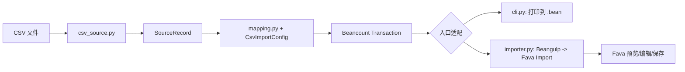

# 代码阅读指南

这份 0.1 预研切片现在收在 `src/bean_import/csv_demo/` 里，自成一体，只依赖 `core`。平台账单那条流水线见 [平台账单原型审阅指引](prototype-review-guide.md)。

它刻意保留两条入口，但共用同一个领域转换函数。先读 `mapping.py` 理解“一个 CSV 行如何成为一笔平衡交易”，再分别跟 CLI 和 Fava 的入口。

## 1. 先记住边界



- 来源适配器解释文件格式；它不知道费用账户如何选择。
- `SourceRecord` 是一行标准化后的来源事实；保留原始字段和定位信息。
- 映射逻辑根据显式配置决定 posting 账户/金额。
- CLI 与 Beangulp importer 只是两种入口，共用 parser 和 mapper。
- Fava 操作的是 Beancount directives，不是内部 `SourceRecord`。跨来源 merge/event resolver 尚未实现。

## 2. 建议阅读顺序

1. [test_mapping.py](../tests/test_mapping.py)：先从支出、收入的预期金额和未知类别行为理解会计映射。
2. [models.py](../src/bean_import/csv_demo/models.py)：认识核心数据类型 `SourceRecord`。
3. [config.py](../src/bean_import/csv_demo/config.py)：看配置加载、字段名默认值和输入检查。
4. [csv_source.py](../src/bean_import/csv_demo/csv_source.py)：看 header 检查、行号、ISO 日期、`Decimal` 和 source ID。
5. [mapping.py](../src/bean_import/csv_demo/mapping.py)：看纯转换函数，理解 posting 符号、目标账户和来源 metadata。
6. [cli.py](../src/bean_import/csv_demo/cli.py)：沿着命令行入口看同一 mapping 如何打印为 Beancount。
7. [importer.py](../src/bean_import/csv_demo/importer.py)：看它如何实现 Beangulp 协议，把相同逻辑交给 Fava。
8. [import_config.py](../examples/fava/import_config.py)：ledger 侧的 Fava 配置模块；`CONFIG` 注册 importer，`HOOKS` 当前为空，它从运行环境导入 `bean_import`。
9. [related_batch.py](../src/bean_import/csv_demo/related_batch.py)：看 manifest 路径约束、一对一银行/支付宝匹配、信息富化、余额独立导入和 fail-closed 错误。
10. 对照 [test_csv_source.py](../tests/test_csv_source.py)、[test_importer.py](../tests/test_importer.py)、[test_related_batch.py](../tests/test_related_batch.py)，看 parser、多个 importer、默认判重和多文件异常。

## 3. 两条调用链

### CLI

```text
bean-import-csv
  -> cli.main()
  -> convert_csv(input, output, config)
  -> load_config()
  -> read_records()
  -> map_record() per SourceRecord
  -> beancount.parser.printer.print_entries()
  -> output .bean file
```

CLI 不运行 Fava，不调用 Beangulp 的 deduplicate；它是最容易调试的纯转换路径。CLI 输出是片段，不自动创建 `open` directives。

### Fava

```text
main.bean: import-config
  -> examples/fava/import_config.py: CONFIG
  -> CsvMappingImporter.identify(path)
  -> Fava lists file + matching importer
  -> Fava calls extract(path, existing_entries)
  -> read_records() -> map_record()
  -> Fava/Beangulp sort and deduplicate
  -> Import preview/edit/save
  -> Fava insert-entry routing
  -> imported.bean
```

Related-file 批次走另一条 Fava 分支：

```text
Fava scans imports/merge-demo.merge.json only
  -> RelatedBatchImporter.identify()
  -> load_manifest(): validate version, relative paths, root containment, size
  -> read bank.csv + alipay.csv into separate SourceRecord lists
  -> classify Alipay funding method
  -> bank-funded rows: exact signed amount/currency + date-window candidate match
  -> require a unique one-to-one match or abort the entire extract
  -> merge matched details into bank transaction
  -> emit unmatched ordinary bank rows + Alipay balance rows independently
  -> Fava preview/save
```

示例匹配规则是保守 demo，而不是通用算法：银行 payee/narration 必须包含配置关键词；金额（含正负号）和 currency 必须一致；日期在配置的闭区间窗口内；银行卡渠道支付宝行与银行行必须一对一。多个候选不按“第一个”猜。此 demo 不从相关文件更新已存在 ledger transaction；Fava/Beangulp 后续只会根据默认 comparator 标记近似重复。

`identify()` 检查文件 header，`account()` 给 Fava 一个关联账户，`date()`/`filename()`主要服务于文件归档/显示；实际生成 entries 的是 `extract()`。两个 profile 识别同一个 CSV，因此 Fava 列出两个选项；用户选一个后才 extract，不会自动运行两次。

CLI 与 Fava 的多匹配行为不同：Beangulp CLI 的 `identify()` helper 要求恰好一个 importer 匹配，多于一个会报错；Fava Import 把匹配项展示为可选动作。对应行为见 `tests/test_importer.py` 的多 profile 测试。

## 4. 最重要的一段：`map_record`

支出 CSV 行 `amount = -12.30`：

```text
Assets:Bank:Checking  -12.30 CNY
Expenses:Food          12.30 CNY
```

收入行 `amount = 12000`：

```text
Assets:Bank:Checking   12000 CNY
Income:Salary         -12000 CNY
```

金额按 `Decimal` 保存，两个 posting 数量互为相反数。映射只按 category 精确查 `[categories]`；未命中抛 `MappingError`，避免输出看似合理但错误的账户。

`Transaction` metadata 另带 `source_id`、`source_category`、`filename`、`lineno` 和 Fava 预览用 `__source__`。Fava 保存时会去除以下划线开头的临时字段，但不会删 `source_id`。

## 5. Beangulp 到 Fava 的接缝

`CsvMappingImporter` 继承 Beangulp `Importer`，实现 `identify`、`account`，并提供 `date`、`filename`、`extract`。Fava Import 配置需导出 `CONFIG` 和 `HOOKS`，当前 `HOOKS = []`，没有自定义分类后处理或跨来源合并。

Fava 调用 importer 后会执行默认排序和去重。当前 Beangulp 默认重复比较基于交易相似度与约两天日期窗口；它**没有使用本项目 metadata 的 `source_id` 作为精确幂等键**。所以 source ID 目前用于可追溯，不要误读成已经实现严格去重。测试还展示：Bank profile 的源账户相同，会标为重复；换成 Wallet 账户时，默认 comparator 不会把它合并成同一条交易。这不是跨来源事件匹配。

Fava 的 `insert-entry` 是 Fava 的账本写入策略，不是 Beangulp importer 的职责。它匹配 posting 账户，并把 entry 插入配置所在文件；本示例把它放在已 include 的 `imported.bean`，与 `main.bean` 隔离。

## 6. 如何安全地扩展

- 新增一个列：改 `CsvColumns`/配置文档，并给解析测试新增覆盖；不在 `mapping.py` 里读文件。
- 增加一种来源格式：新建 adapter，输出相同的 `SourceRecord`，继续复用/替换 mapper；不让各个解析器自己写 Fava UI。
- 增加商户别名/规则：独立建 `SuggestionProvider`/rule 模块，不要让来源适配器硬编码个人账户。
- 增加跨平台关联：新增 Reconciler，保存匹配证据和候选关系；不要直接删除一行或把两个原始金额相加。
- 修改金额语义：先改测试里的支出/收入例子，再改纯映射函数；用 `uv run bean-check` 对含账户定义的完整 ledger 做验证。

建议每次只跟一条路径：`SourceRecord → map_record → Transaction`。掌握这一段后，再读 Fava/Beangulp 的入口协议。`uv run pyright` 使用 strict 模式；Beancount printer 的第三方类型信息不完整，CLI 调用点有一个局部 Pyright ignore，不代表项目关闭了严格检查。
