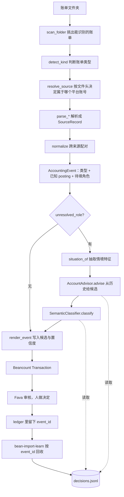

# 平台账单原型：设计与代码阅读指引

**对象：** `src/bean_import/` 全部模块，以及 `examples/prototype/` 这条可以真跑的流水线
**分支：** `dev`
**日期：** 2026-09-29

这份文档是给 review 用的。它回答三件事：这套东西跑起来是什么样、每一层负责什么、读代码时该在哪儿停下来提问。

0.1 预研的 CSV 样例现在收在 `src/bean_import/csv_demo/` 里，自成一体，本文不展开，见 [code-reading-guide.md](code-reading-guide.md)。

---

## 1. 怎么用这份文档

1. 第 2 节，先跑起来，看见输出再读代码。
2. 第 3 节，全景图。
3. 第 4 节，**分层规则和端口**。这是本次改动的主要设计意图；不理解这条，后面每个文件的取舍都会显得随意。
4. 第 5 节，五个数据契约。契约看懂了，中间的函数基本可预测。
5. 第 6 节，按阶段读代码。每个阶段末尾有「review 时问什么」。
6. 第 7 节，跟着一笔真实交易走完「提议 → 人工修正 → 回收 → 下次更好」的完整闭环。
7. 第 8 节，**在 Fava 里真跑三个月之后，哪些假设站住了、哪些被打脸了**。如果你只想看一节，看这节。
8. 第 9 到 12 节：测试地图、已知弱点、检查清单、文件索引。

想自己动手验一遍而不是读结论，直接看 [人工验收步骤](manual-test.md)：十个场景，每步写明在界面上做什么、该看到什么数字。

源码约 2600 行（不含 0.1 样例和测试），一次完整阅读约 2 小时。

---

## 2. 先跑一遍

### 2.1 环境

```sh
uv sync --group dev --extra fava
uv run ruff format --check . && uv run ruff check . && uv run pyright && uv run pytest
```

当前状态：119 个测试通过，ruff / ruff format / pyright 均无告警。

### 2.2 导入

```sh
uv run bean-import-batch \
  --config examples/prototype/ledger.toml \
  --output /tmp/prototype.bean
```

不带文件参数时读配置里的 `[batch].folder`。四份账单共 7 行原始记录，合成 5 条事件：

| 日期 | 摘要 | 事件类型 | 分类 | posting |
| --- | --- | --- | --- | --- |
| 2026-09-02 | 瑞幸咖啡 / 生椰拿铁 | expense | unknown | BOC 借记 -32.00，Expenses:Unknown +32.00 |
| 2026-09-03 | 兰州拉面 / 牛肉面 | expense | unknown | 微信零钱 -18.00，Expenses:Unknown +18.00 |
| 2026-09-04 | 超市 / 购物 | expense | unknown | BOC 信用卡 -58.00，Expenses:Unknown +58.00 |
| 2026-09-05 | 中国银行 / 信用卡还款 | repayment | structural | 借记 -200.00，信用卡 +200.00 |
| 2026-09-06 | 微信 / 零钱提现 | transfer | structural | 零钱 -50.00，借记 +50.00 |

支付宝那笔和中行借记卡那笔被认成同一次消费；还款的两行被认成同一次还款。

### 2.3 回收人工决策

在 Fava（或任何编辑器）里把 `Expenses:Unknown` 改成真实账户并保存，然后：

```sh
uv run bean-import-learn \
  --config examples/prototype/ledger.toml \
  --ledger examples/prototype/main.bean
```

实测输出：

```
检查 3 条提议，新结算 3 条，待定 0 条

记录 3 条，已结算 3 条，待定 0 条
接受 0，修正 2，仍未知 1，拆分 0
覆盖率 67%，命中率 0%

账户                                    提议    接受    修正    最终
Expenses:Food:Quick                    0     0     0     2
Expenses:Unknown                       2     0     2     1

最常见的修正：
  Expenses:Unknown -> Expenses:Food:Quick × 2
```

命中率 0% 是对的：里程碑 1 从不提议具体账户，所以它每一次都「输」。这个数字存在的意义是，等模型或历史开始提议时，它会立刻变成可比较的基线。

### 2.4 下一次导入

再下载一份类似账单，重跑 2.2，新交易的 metadata 会多出三行：

```
candidates: "Expenses:Food:Quick 0.36"
confidence: "0.36"
candidate_evidence: "1 笔相似记录；最近 2026-09-03；对手相同、名称相近、平台分类相同、中午、工作日、金额相当；如 兰州拉面"
```

账户仍然是 `Expenses:Unknown`——**系统没有替你决定**，它只是把你自己以前的决定摆在你眼前。

### 2.5 Fava

```sh
uv run fava examples/prototype/main.bean
```

已实测（Fava 1.30.16）：

1. 导入页只有一个可导入条目，就是 `ledger.toml` 本身，importer 名字是 `Statement folder statements`。`statements/` 里的 CSV 都显示「无 importer」，不会被当成多批账单。
2. 提取得到上表那几笔，metadata 完整，`candidates` 直接显示在预览里。
3. 保存写入 `imported.bean`（若未配置 `insert-entry`，Fava 会追加到主账文件），accounts 不被修改。
4. 待办清单不是标签，是账户：在 Fava 里筛 `Expenses:Unknown` 就是「今天要处理的」。早期版本写过 `#needs-review` 标签，实测发现它在你改完账户之后仍然留在账本里，反而把已处理的和没处理的混在一起，已经删掉。
5. 再次提取同一文件夹，八笔全部被标成 duplicate——**包括你上一轮亲手改过账户的那几笔**。这一条是实测出来的坑：beangulp 默认按「账户 + 金额」判重，而审核恰恰就是在改账户，所以第一次审核之后原本的判重就失效了。现在改成先按 `event_id` 精确判重（`app/fava.py::mark_known_events`），`event_id` 只由账单原始行算出，你在账本这边怎么改都不影响它。所以「把账单反复下载进同一个文件夹」确实是安全的，但安全来自这个补丁，不是来自 beangulp 的默认行为。

---

## 3. 全景



两句话：

- **能从账单本身算出来的，代码算；算不出来的，绝不猜。**
- **人做的每一个决定都要能被找回来。** 找回的方式是账本里的 `event_id`，不是原始账单——账单早就删了。

---

## 4. 分层与端口

### 4.1 依赖方向

每一层只能依赖它下面的层。这条规则不是写在文档里，是 `tests/test_architecture.py` 用 AST 检查的。

```
app          组装：pipeline / factory / fava / cli        ← 唯一允许认识多个适配器的层
 ├── sources     账单文件 → SourceRecord                   （依赖 core, config）
 ├── config      TOML → CustomerConfig                     （依赖 core）
 ├── journal     决策日志：JSONL / 内存 / 空实现            （依赖 core）
 ├── advice      从历史决策给候选账户                        （依赖 core）
 ├── learning    从账本回收人工决策 + 评分                    （依赖 core）
 ├── semantic    可选的模型调用                              （依赖 core）
 └── clock       唯一读系统时间的地方                         （依赖 core）
core         领域模型、端口协议、归一化、渲染                  （不依赖任何人）
```

`core` 里没有任何文件 IO、网络和时钟读取。`csv_demo` 是 0.1 的样例，只依赖 `core`，跟上面这张图互不干扰。

### 4.2 端口

所有缝隙集中在一个文件 `core/ports.py`。每个协议至少有两个实现，其中一个简单到可以直接当 mock 用：

| 协议 | 实现 | 替换它意味着 |
| --- | --- | --- |
| `SemanticClassifier` | `UnknownClassifier` / `HistoryClassifier` / `OpenAICompatibleClassifier` / `FirstResolved` 组合 | 换一个模型，或者根本不用模型 |
| `AccountAdvisor` | `NullAdvisor` / `HistoryAdvisor` | 换一套记忆检索，甚至换成向量库 |
| `DecisionJournal` | `NullJournal` / `InMemoryJournal` / `JsonlJournal` | 换存储，或者完全关掉 |
| `LedgerOutcomes` | `DirectiveOutcomes` / `LedgerFile` | 换账本读取方式 |
| `Clock` | `FixedClock` / `SystemClock` | 测试里把时间钉死 |

`app/factory.py` 是唯一把它们拼起来的地方。`import_files(..., components=...)` 接受任意一套实现，所以任何一层都可以被单独测：`tests/app/test_pipeline.py` 就是用三行 mock 把整条流水线跑通的。

### 4.3 里程碑仍然是物理边界

| | 里程碑 1（默认） | 里程碑 1.5（可选） | 里程碑 2（可选） |
| --- | --- | --- | --- |
| 做什么 | 解析、身份识别、配对、渲染、记日志 | 历史候选达到阈值就自动填 | 模型在允许账户里选 |
| 开关 | 无需配置 | `[advice].auto_accept_above > 0` | 出现 `[semantic]` 表 |
| 代码 | `core/` `config/` `sources/` `journal/` `advice/` `learning/` `app/` | `advice/classifier.py` | `semantic/` |

可以直接验证的两条：

- `rg "bean_import.semantic" src/` 只命中 `app/factory.py`，而且是函数内导入。`tests/test_architecture.py::test_only_the_composition_root_mentions_the_model_and_only_lazily` 用 AST 保证这一点。
- 删掉整个 `src/bean_import/semantic/` 目录，里程碑 1 照常工作。

---

## 5. 五个数据契约

读懂这五个 dataclass，中间的函数基本可预测。

### 5.1 `SourceRecord`（`core/models.py`）

一行原始账单，不可变。金额是**站在出资账户视角的有符号 Decimal**，支出为负。

### 5.2 `AccountingEvent`（`core/models.py`）

一次经济活动，可能由多行账单合成。关键字段是 `unresolved_role`：

- `None` —— 两边账户都确定（还款、转账），没有任何东西需要猜。
- `"expense_account"` / `"income_account"` —— 缺一个对方账户，且方向已经由金额正负确定。

### 5.3 `ClassificationRequest`（`core/classification.py`）

分类器**唯一**能看到的事实。它不包含原始行，也不包含其它交易。`allowed_accounts` 是账本允许的账户白名单，`known_accounts` 是结构上已经确定的那一边。

### 5.4 `Situation`（`core/situation.py`）

同一笔交易的**特征视图**：星期、时钟、时段、是否周末、金额与绝对值、对手、说明、平台分类、渠道、分词。

这个类型存在的理由是一致性：给模型看的情境、给相似度打分的特征、写进日志的快照，必须是同一份。三处各算一遍，学到的东西和当时看到的东西就会悄悄错位。

### 5.5 `JournalEntry`（`core/journal.py`）

一条提议，以及后来知道的决定：

```
Situation（当时看到的）
known_accounts / allowed_accounts / unknown_account（当时的约束）
Proposal（提了什么、来自谁、多有把握、候选是什么）
Decision | None（人最后写了什么）
```

`Decision.outcome` 只有四种，信号强度完全不同：

| outcome | 含义 | 学习权重 |
| --- | --- | --- |
| `corrected` | 人明确改成了别的账户 | 最高（默认 1.0） |
| `accepted` | 人保留了提议 | 较低（默认 0.4） |
| `abstained` | 人也留在 unknown | 0，这是弃权不是答案 |
| `split` | 拆成多个账户或改了金额 | 0，记录但不训练 |

`accepted` 权重必须明显低于 `corrected`，否则系统会把「用户懒得改」当成「用户认可」，然后用自己的输出训练自己。

---

## 6. 按阶段读代码

### 阶段 1：文件夹 → 账单清单（`app/fava.py`）

`scan_folder` 把一个目录切成「能识别的账单」和「跳过的文件」。`.pdf`/`.eml`/`.zip`/`.toml`/`.bean`/`.md`/`.json` 直接跳过；超过 8 MB 的文件是报错而不是跳过。

Fava 只会用单个文件路径调 importer，所以对 Fava 可见的那个「文件」就是 `ledger.toml` 本身：认出它，等于「导入它指向的文件夹里的一切」。这样新账单到来时不需要编辑任何清单。

> **review 时问什么**：把 `ledger.toml` 当成导入入口是不是太绕？替代方案是维护一份 batch 清单，但那要求每次下载后改文件。

### 阶段 2：身份识别（`sources/identity.py`）

从账单前 4000 字符里抽身份：微信 `微信昵称：[xxx]`、支付宝 `姓名：` 和 `支付宝账户：157**********`、中行借记卡 `客户姓名：` 和 19 位卡号。

`match_rank` 分三档：3 = 规范化后完全相同，2 = 双方都有 ≥8 位数字且后四位相同，1 = 子串。**只取最高档**，平局或零匹配一律报错。

> **review 时问什么**：分档是必需的——`小明` 是 `小明工作号` 的子串，不分档就会抢走对方的账单。中行信用卡账单没有持卡人身份，只有每行的卡号后四位，所以信用卡多账户目前靠 `[[cards]]` 而不是 `identity`。

### 阶段 3：解析（`sources/wechat.py` / `alipay.py` / `boc.py`）

每个解析器只做一件事：把一种账单变成 `SourceRecord`。支付宝的 GBK 编码、微信的 `¥` 前缀、中行的 `------` 占位符都在这里吸收。

### 阶段 4：跨来源配对（`core/normalize.py`）

三种配对，全部要求**唯一 1-1**：钱包侧的银行卡支付 ↔ 银行侧的清算；借记卡流出 + 信用卡流入且含「还款」→ 还款；微信提现/充值且对手卡已知 → 转账。

任何一个方向有多个候选，就都不合并，各自保留，写上 `link_candidates` 和 `ambiguous-link` 标签。

> **review 时问什么**：合并后日期和金额取银行侧，对手和说明取钱包侧，`occurred_at` 取带冒号的那个。这个取舍对不对？

### 阶段 5：情境抽取（`core/situation.py`）

`situation_of(request)` 是纯函数。中文分词用的是字符二元组而不是分词器：`瑞幸咖啡` 和 `瑞幸咖啡(中关村店)` 因此能重合，代价是引入了一点噪声。

### 阶段 6：候选（`advice/`）

`HistoryAdvisor` 读已结算的日志，对每条算：

```
score = 相似度 × 结果权重 × 0.5 ** (天数 / 半衰期)
```

相似度（`advice/similarity.py`）是七项加权：对手相同 4、分词重合 3、平台分类相同 1.5、金额接近 1.5、时段相同 1、渠道重合 1、工作日/周末相同 0.5。金额按**比值**衰减而不是差值，四倍以外归零。

置信度做了两次处理：

- 份额：`该账户得分 / 全部得分`
- 饱和：`总分 / (总分 + 1.5)`

所以「只有一条很像的记录」不会变成 100% 的把握，只会变成 0.4 左右。这一条是刻意的：给人看的数字必须诚实，否则它很快就会被忽略。

> **review 时问什么**：七项权重是我拍的，没有调参。半衰期 180 天也是。这些应该由 `bean-import-learn` 的命中率来验证，而不是靠直觉——目前还没做自动调参，这是有意的，样本量太小时调参就是过拟合。

### 阶段 7：分类（`core/classifiers.py` / `advice/classifier.py` / `semantic/llm.py`）

一个接口：

```40:48:src/bean_import/core/ports.py
class SemanticClassifier(Protocol):
    def classify(
        self,
        request: ClassificationRequest,
        advice: Advice,
    ) -> Classification:
        """Choose one allowed account, or the unknown account when unsafe."""

        ...
```

`FirstResolved` 把若干分类器串起来，第一个给出结论的胜出，最后一环永远是 `UnknownClassifier`。所有失败路径——调用失败、JSON 重试一次仍然坏、模型自称不确定、选了白名单外的账户——都收敛到同一个 `unknown()`，只是 `reason` 不同。

模型永远不可能让导入失败，也不可能产生账本里不存在的账户。

### 阶段 8：渲染（`core/render.py`）

未定账户的交易额外带上 `candidates`：「你以前在很像的场合选过什么、有多像」。审核的人不需要重新打开账单就能决定，这就是「人工选择时的信心」的全部实现。

这里有一个实测教训：**Fava 保存的就是你看到的那条交易，所以写进 metadata 的东西会永久留在账本里**。第一版把置信度和一整句中文证据（「1 笔相似记录；最近 2026-10-05；对手相同、名称相近、平台分类相同、晚上、工作日、金额相当」）都写进去，结果每一笔咖啡下面都挂着一段只对那一次审核有用的散文。现在由 `[advice].metadata` 决定账本愿意留多少：

| 取值 | 留下什么 |
| --- | --- |
| `none` | 什么都不留 |
| `short`（默认） | 只留一行 `candidates` |
| `full` | 连 `confidence`、`candidate_evidence`、弃权理由一起留 |

`classification_reason` 单独有一条规则：**弃权的理由是每行都一样的套话，默认不写；模型真的选了某个账户时的理由不是，永远写**。后者是你日后回头问「它当时凭什么这么判」的唯一线索。

同样出于「写进去就是永久」的考虑，这里不再打 `#needs-review` 标签。标签是在导入那一刻写下的，它没法知道你在同一次审核里已经把账户改好了；而 `Expenses:Unknown` 这个账户本身永远是准确的筛选条件。

### 阶段 9：记日志（`journal/`）

JSONL，只追加。读的时候按 `event_id` 去重，`merge()` 决定同一件事的两条记录怎么合并，它挡住了两个先后踩到的坑：

1. **重新导入不能抹掉已经回收到的人工决策。**（冒烟测试发现）
2. **已经结算的记录必须整条冻结，连「我们当时提议了什么」也不许改写。**（free style 测试发现）第二条更隐蔽：重新导入会把整条流水线重跑一遍，而这时候顾问已经从你那次修正里学到了东西，于是它提议的正是你当初选的那个账户——可是没有任何人看过这条提议，因为 Fava 把这一行列为 duplicate，根本不会再送到你眼前。如果让它覆盖原记录，我们就是在拿已经知道的答案给自己打分，而且每重新导入一次分数就涨一点。实测中这让「命中率」凭空变成 80%，实际上系统一次都没提议过。

`settle()` 会把文件重写成紧凑形式，走临时文件 + 原子替换。

### 阶段 10：回收与评分（`learning/`）

`learning/ledger.py` 按 `event_id` 索引账本里的交易。`core/journal.py::judge` 是纯函数：账本里除 `known_accounts` 之外剩下的账户，恰好一个才可判定，否则算 `split`。

`harvest` 会重判**所有**条目而不只是未结算的，因为半年后手工重分类同样是一次修正，也应该被学到。反过来，如果一条已结算的记录在账本里找不到了，`harvest` 不会悄悄把它当成待定、也不会抹掉决策（你可能只是 `--ledger` 指错了文件），而是单独报一行「N 条已结算的记录在账本里找不到了」。

`learning/report.py` 给两个互相拉扯的数字：**覆盖率**（敢提议的比例）和**命中率**（提议被保留的比例）。

报告里最要紧的一条区分，也是 free style 测试逼出来的：**「系统提议了账户、你留下或改掉」和「系统弃权、你自己填了一个」是两回事**。前者是一次有答案的预测，后者是一份白送的标注。第一版把两者混在一起，于是里程碑 1（永远弃权）报出了「覆盖率 85%、`Expenses:Unknown` 提议 11 修正 11」——听上去像一个次次都猜错的分类器，其实它一次都没猜过。现在这两类分开计，里程碑 1 老老实实报「覆盖率 0%（还没有提议过账户），已积累可学习样本 N 条」。

真实的三轮实测（`auto_accept_above = 0.3`）：

| 轮次 | 提议 | 保留 | 被改 | 你自己填 | 覆盖率 | 命中率 |
| --- | --- | --- | --- | --- | --- | --- |
| 9 月 | 0 | 0 | 0 | 2 | 0% | — |
| 10 月 | 0 | 0 | 0 | 4 | 0% | — |
| 11 月 | 3 | 2 | 1 | 4 | 33% | 67% |

前两轮证据不够，系统一次都不敢开口；第三轮越过阈值才开始提议。这正是它该有的样子。

---

## 7. 一笔交易的完整闭环

以 `examples/prototype/statements/` 里的瑞幸咖啡 32 元为例。

1. **两份账单，两行记录。** 支付宝那行写着「瑞幸咖啡 / 生椰拿铁 / 餐饮美食 / -32.00 / 08:00」，中行借记卡那行写着「消费 / 支付宝-快捷支付 / -32.00 / 120102」。
2. **`normalize`** 在 2 天窗口里找到唯一的 1-1 匹配，合成一条 `AccountingEvent`：日期取银行侧 `2026-09-02`，对手和说明取钱包侧，`unresolved_role = "expense_account"`，已知 posting 是 `Assets:Bank:BOC:Debit -32.00`。
3. **`situation_of`** 得到：星期二、08:00、早晨、工作日、金额 32、对手瑞幸咖啡、分词 {瑞幸, 幸咖, 咖啡}、渠道 (alipay, boc_debit)。
4. **`HistoryAdvisor`** 第一次跑时日志是空的，返回空候选。
5. **`UnknownClassifier`** 返回 `Expenses:Unknown`，`status = unknown`。
6. **`render_event`** 产出交易，不带 `candidates`（因为没有），也不打标签。
7. **`JsonlJournal`** 记下一条 `JournalEntry`，`decision = null`。
8. **人在 Fava 里**把 `Expenses:Unknown` 改成 `Expenses:Food:Quick` 并保存。`event_id` 原样留在账本里。
9. **`bean-import-learn`** 读账本，按 `event_id` 找到这条，`judge` 判定 `corrected`，写回日志。这一步之后，原始 CSV 可以删掉了。
10. **下一次**买咖啡时，`HistoryAdvisor` 算出相似度 0.9 上下，衰减后得分约 0.85，置信度约 0.36，于是新交易带上 `candidates: "Expenses:Food:Quick 0.36"` 和一句人话证据。账户仍然是 unknown，决定权仍然在人手上。
11. 如果账本里写了 `[advice].auto_accept_above = 0.3`，等证据攒够（实测第三个月越过阈值），第 10 步会直接填上账户，`model_id` 记为 `history`，并把「凭什么这么判」写进 `classification_reason`。

第 9 步是整套设计的支点：**学习信号不在账单里，也不在账本里，而在「提议」和「决定」的差值里**，而这个差值只有在 review 的那一刻存在。日志的唯一作用就是把它保存下来。

---

## 8. 实测：哪些假设站住了，哪些没有

上面那条闭环是设计。下面是真的在 Fava 里跑了三个月（9/10/11 三轮下载 + 审核 + 回收）之后的结果。**单元测试一个都没红，五个问题全是在 Fava 里手动点出来的**，这本身值得记一笔。

### 站住了的

| 假设 | 怎么验的 |
| --- | --- |
| 原始账单可以删 | 把 `statements/` 整个改名，回收照样跑通——连接点是账本里的 `event_id`，不是文件 |
| 几个月后手工重分类也能学到 | 直接改账本里一笔早已结算的交易，下次 `bean-import-learn` 重新判成 `corrected` |
| 拆分不会被当成单标签样本 | 把一笔 268 元拆成两个账户，判成 `split`，记录但不学 |
| 相似度能跨商户泛化 | 只教过「兰州拉面」，「老王牛肉面」就拿到了候选（二元组分词 + 同平台分类 + 金额相近） |
| 阈值确实压得住早期的冲动 | `auto_accept_above = 0.3` 下，前两轮一次都没提议，第三轮才开口 |

### 没站住的（都已修）

| 问题 | 实测现象 | 修法 |
| --- | --- | --- |
| **判重在第一次审核之后就失效** | 8 笔已入账的交易里只有 1 笔被标成 duplicate，恰好就是唯一一笔我没改过账户的 | `app/fava.py::mark_known_events`，按 `event_id` 精确判重 |
| **`#needs-review` 标签会变味** | BQL 查出 12 笔带标签，其中只有 1 笔真的还没处理 | 删掉标签，改用 `Expenses:Unknown` 筛 |
| **候选证据被永久写进账本** | 一碗牛肉面下面挂着一整段中文证据，而它只对那一次审核有用 | `[advice].metadata`，默认 `short` |
| **报告把弃权算成预测** | 里程碑 1 报「覆盖率 85%、`Expenses:Unknown` 提议 11 修正 11」 | 提议和标注分开计，见 §6 阶段 10 |
| **重新导入会给自己刷分** | 命中率一度显示 80%，而系统实际上一次都没提议过 | `merge()` 冻结已结算的记录 |

最后一条最值得看：它是前面几条修完之后才浮出来的，**而且方向是系统性地高估自己**。如果只看单元测试和报告数字，这个 bug 可以活很久。

---

## 9. 测试地图

119 个测试，目录结构和 `src/` 一一对应。

| 文件 | 守住什么 |
| --- | --- |
| `tests/test_architecture.py` | 依赖方向、core 零依赖、模型只被惰性导入 |
| `tests/core/test_situation.py` | 时间、时段、分词、金额符号 |
| `tests/core/test_render.py` | 候选 metadata、三档详细程度、不打标签、不平衡就报错 |
| `tests/core/test_classifiers.py` | 不用模型时的行为、分类器链的短路 |
| `tests/core/test_judge.py` | 四种人工结果的判定 |
| `tests/config/test_customer.py` | 卡号尾号冲突、多账号必须有身份、skill 越界、参数边界 |
| `tests/sources/test_statements.py` | GBK、容器文件拒绝、两个微信号分辨、身份分档 |
| `tests/journal/test_journal.py` | 编解码往返、幂等、不抹掉决策、坏行定位、三种适配器等价 |
| `tests/advice/test_similarity.py` | 相似度、金额按比值衰减、时间半衰期 |
| `tests/advice/test_history.py` | 排序、修正优先于接受、弃权不学、旧习惯让位、收入不串到支出 |
| `tests/advice/test_history_classifier.py` | 阈值、白名单、证据不足就不填 |
| `tests/learning/test_harvest.py` | 待定、修正、半年后改判、账本里消失的记录、重复回收幂等 |
| `tests/learning/test_report.py` | 提议与标注分开计、里程碑 1 报 0 覆盖、混淆表 |
| `tests/semantic/test_llm.py` | 提示词内容、越界账户、坏 JSON 重试一次、断网退化、检索记忆优先 |
| `tests/app/test_fava.py` | 改过账户之后仍然判重、拆分之后仍然判重、没有 `event_id` 不乱认 |
| `tests/app/test_pipeline.py` | 里程碑 1 端到端、模糊匹配不合并、收入方向、mock 替换 |
| `tests/app/test_learning_loop.py` | **完整闭环**：提议 → 修正 → 回收 → 下次有候选 → 够强时自动填 |
| `tests/csv_demo/*` | 0.1 样例，未改动 |

没有任何测试会调真实模型；`semantic` 全部通过注入的 transport 测。

---

## 10. 我知道的弱点

1. **相似度权重和半衰期是拍的。** 应该由命中率驱动调参，但样本太少时调参就是过拟合，所以现在只暴露成配置。
2. **中文分词用二元组**，`兰州拉面` 和 `兰州牛肉面` 重合度偏高，`面` 类商户之间会互相污染。
3. **`split` 完全不学。** 拆分账单其实包含很强的信息（「这家店我会拆成两类」），现在只是记录。
4. **候选只按账户聚合**，没有「这个场景下你通常怎么拆」的概念。
5. **信用卡多账号靠 `[[cards]]`**，因为中行信用卡账单头里没有持卡人身份。
6. **`bean-import-learn` 需要手动跑。** Fava 有 `after_insert_entry` 扩展钩子（已验证会触发），可以做到保存即回收，但那会把 Fava 变成必需品；目前保持工具无关。
7. **日志会一直变长。** 没有归档和压缩策略，几年后需要处理。
8. **`accepted` 权重是猜的 0.4。** 这个数字直接决定系统有多容易自我确认，值得用真实数据验证。

---

## 11. Review 检查清单

- [ ] `tests/test_architecture.py` 里的 `ALLOWED` 表，和你认为合理的分层一致吗？
- [ ] `core/ports.py` 的五个协议，粒度是不是太粗或太细？
- [ ] `Situation` 该不该包含出资账户？现在只用 `source_types` 近似。
- [ ] `judge` 的「恰好一个对方账户」规则，在你的真实账本里会不会经常判成 `split`？
- [ ] `corrected` 1.0 / `accepted` 0.4 这个比例，你接受吗？
- [ ] 置信度的饱和函数（`总分 / (总分 + 1.5)`）会不会让数字长期偏低到没人看？
- [ ] `[advice].metadata` 默认 `short`，只在账本里留一行 `candidates`。这一行你愿意永久留着吗？不愿意就设成 `none`。
- [ ] 默认开启日志（`decisions.jsonl` 放在账本旁边）是否可以接受？
- [ ] `auto_accept_above` 默认 0（永不自动填）是对的吗？

---

## 12. 文件索引

| 路径 | 行数量级 | 作用 |
| --- | --- | --- |
| `core/models.py` | 60 | `SourceRecord` / `AccountingEvent` |
| `core/classification.py` | 95 | 请求、结论、`accept` / `unknown` |
| `core/situation.py` | 150 | 特征抽取，含中文分词 |
| `core/advice.py` | 70 | `Candidate` / `Advice` |
| `core/journal.py` | 150 | 日志条目、`merge`、`judge` |
| `core/ports.py` | 75 | **全部五个协议** |
| `core/classifiers.py` | 55 | `UnknownClassifier` / `FirstResolved` |
| `core/normalize.py` | 310 | 跨来源配对 |
| `core/render.py` | 90 | 事件 → Transaction，含审核 metadata |
| `config/customer.py` | 470 | TOML 加载与校验 |
| `sources/*` | 500 | 四种账单的解析与身份识别 |
| `journal/codec.py` | 210 | JSON 编解码 |
| `journal/jsonl.py` | 80 | 追加写、去重读、原子重写 |
| `journal/memory.py` | 50 | `NullJournal` / `InMemoryJournal` |
| `advice/similarity.py` | 130 | 相似度与衰减 |
| `advice/history.py` | 185 | 检索与置信度 |
| `advice/classifier.py` | 45 | 阈值自动填 |
| `learning/ledger.py` | 70 | 按 `event_id` 索引账本 |
| `learning/harvest.py` | 65 | 回收 |
| `learning/report.py` | 175 | 覆盖率 / 命中率 / 混淆 |
| `semantic/knowledge.py` | 130 | skill + 情境 + 记忆 |
| `semantic/llm.py` | 210 | OpenAI 兼容调用 |
| `app/factory.py` | 140 | **组装的唯一入口** |
| `app/pipeline.py` | 140 | 一次导入的固定顺序 |
| `app/fava.py` | 145 | beangulp / Fava 入口 |
| `app/cli/batch.py` | 70 | `bean-import-batch` |
| `app/cli/learn.py` | 60 | `bean-import-learn` |
