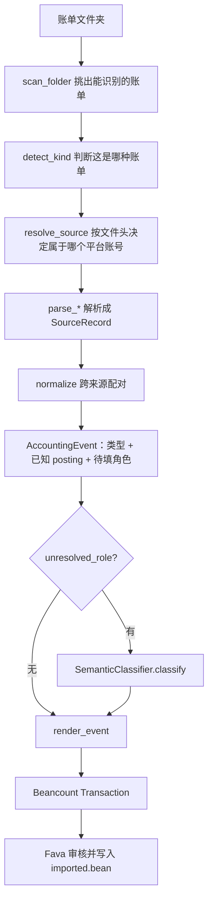

# 平台账单原型：设计与代码阅读指引

**对象：** `examples/prototype/` 这条流水线，以及它依赖的 `src/bean_import/` 模块
**分支：** `dev`
**日期：** 2026-09-28

这份文档是给 review 用的。它回答三件事：这套东西跑起来是什么样、每一层负责什么、读代码时该在哪儿停下来提问。

0.1 预研的 CSV 样例（`csv_source.py`、`mapping.py`、`importer.py`、`related_batch.py`）不在这份文档范围内，它们由 [code-reading-guide.md](code-reading-guide.md) 描述，本次改动没有动它们。

---

## 1. 怎么用这份文档

建议按这个顺序：

1. 第 2 节，先把它跑起来，看见输出再读代码。
2. 第 3 节，看一眼全景图，知道一次导入被切成了几段。
3. 第 4 节，理解分层规则。这是这次改动的主要设计意图，不理解这条，后面每个文件的取舍都会显得随意。
4. 第 5 节，读四个数据契约。契约看懂了，中间的函数基本是可预测的。
5. 第 6 节，按阶段读代码。每个阶段末尾有「review 时问什么」，那是我认为值得你挑战的地方。
6. 第 7 节，跟着一笔真实交易从两份账单走到最终分录。
7. 第 9 节和第 10 节，测试地图和我自己知道的弱点。

全部代码约 1900 行（不含 0.1 样例和测试），一次完整阅读大约 1.5 小时。

---

## 2. 先跑一遍

### 2.1 环境

```sh
uv sync --group dev --extra fava
uv run ruff check . && uv run pyright && uv run pytest
```

当前状态：27 个测试通过，ruff 和 pyright 无告警。

### 2.2 命令行

```sh
uv run bean-import-batch \
  --config examples/prototype/ledger.toml \
  --output /tmp/prototype.bean
```

不带文件参数，读的是配置里的 `[batch].folder`。输出 5 笔交易：

| 日期 | 摘要 | 事件类型 | 分类 | posting |
| --- | --- | --- | --- | --- |
| 2026-09-02 | 瑞幸咖啡 / 生椰拿铁 | expense | unknown | BOC 借记 -32.00，Expenses:Unknown +32.00 |
| 2026-09-03 | 兰州拉面 / 牛肉面 | expense | unknown | 微信零钱 -18.00，Expenses:Unknown +18.00 |
| 2026-09-04 | 超市 / 购物 | expense | unknown | BOC 信用卡 -58.00，Expenses:Unknown +58.00 |
| 2026-09-05 | 中国银行 / 信用卡还款 | repayment | structural | 借记 -200.00，信用卡 +200.00 |
| 2026-09-06 | 微信 / 零钱提现 | transfer | structural | 零钱 -50.00，借记 +50.00 |

四份账单一共 7 行原始记录，合成 5 条事件：支付宝那笔和中行借记卡那笔被认成同一次消费，还款的两行被认成同一次还款。

### 2.3 Fava

```sh
uv run fava examples/prototype/main.bean
```

已实测的完整链路（Fava 1.30.16）：

1. 加载 `main.bean` 无错误。
2. 导入页只有一个可导入条目，就是 `ledger.toml` 本身，importer 名字是 `Statement folder statements`。`statements/` 里的四份 CSV 都显示「无 importer」，不会被当成四批独立账单。
3. 提取得到上表那 5 笔，metadata 完整（`event_id`、`source_id`、`filename`、`lineno`、`classification`）。
4. 保存后写入 `imported.bean`（由该文件里的 `insert-entry` 选项路由），主账 `main.bean` 不被修改。
5. 重新加载，`api/errors` 为空，账本里出现 `Expenses:Unknown` 和 `Income:Unknown`。
6. **再次对同一文件夹执行提取，5 笔全部被 Fava 标成 duplicate。** 所以把账单反复下载进同一个文件夹是安全的，不会重复入账。

第 4 步之后 `imported.bean` 的内容和 CLI 输出一致，只是 metadata 按字母序重排、posting 对齐方式不同，这是 Fava 的 printer 行为。

---

## 3. 全景



一句话：**能从账单本身算出来的，代码算；算不出来的，要么留给人，要么留给模型，但绝不猜。**

---

## 4. 分层与里程碑

这是本次设计的核心。两个里程碑不是排期，是模块边界。

| | 里程碑 1（当前默认） | 里程碑 2（可选） |
| --- | --- | --- |
| 做什么 | 解析、身份识别、跨来源配对、事件类型、转账/还款、渲染、Fava 入口 | 生活 skill、情境抽取、账本记忆、模型调用、账户校验 |
| 代码 | `sources/`、`normalize.py`、`render.py`、`classify.py`、`pipeline.py`、`batch_*.py` | `semantic/knowledge.py`、`semantic/llm.py` |
| 配置 | `ledger.toml`，必须有 `[unknown]` | 追加一张 `[semantic]` 表 |
| 分类结果 | 按金额方向落到 unknown 账户 | 模型在允许账户里选，失败退回 unknown |

依赖规则，review 时可以直接验证：

- 确定性模块**不导入** `bean_import.semantic`。可以用 `rg "bean_import.semantic" src/` 检查，只有 `pipeline.py` 会命中，而且是在 `build_classifier` 里的函数内导入。
- 删掉整个 `src/bean_import/semantic/` 目录，里程碑 1 仍然能跑（前提是配置里没有 `[semantic]`）。
- 唯一的接口在 `classify.py`：

```53:64:src/bean_import/classify.py
class SemanticClassifier(Protocol):
    def classify(self, request: ClassificationRequest) -> Classification:
        """Choose one allowed account, or the unknown account when unsafe."""

        ...


class UnknownClassifier:
    """Milestone 1: keep the direction that is certain, refuse to invent a category."""

    def classify(self, request: ClassificationRequest) -> Classification:
        return unknown(request, "未启用语义分类，按金额方向归入未知账户")
```

`UnknownClassifier` 不是占位符，它是里程碑 1 的正式实现：方向是确定的（金额为负就是支出），类别是不确定的，所以只给出方向。

**review 时问什么**

- 接口只有一个方法、一个请求结构、一个返回结构，够不够将来换实现？如果以后想要「一次分类一批交易」以省 token，这个接口要怎么改？
- `Classification.status` 目前是 `"accepted"` / `"unknown"` 两个字符串常量。要不要改成枚举？

---

## 5. 四个数据契约

读懂这四个，中间的函数就没有秘密了。

### 5.1 `SourceRecord`（`models.py`）

一份账单里的一行，解析后就不可变。

| 字段 | 含义 | 谁填 |
| --- | --- | --- |
| `source_id` | 平台流水号，没有就用原始列的 SHA-256 指纹 | 适配器 |
| `row_number` / `source_file` | 回溯定位 | 适配器 |
| `transaction_date` | 记账日期 | 适配器 |
| `occurred_at` | 原始时间戳字符串，可能带钟点 | 适配器 |
| `amount` | **资金账户视角的带符号 Decimal**，流出为负 | 适配器统一符号 |
| `source_account` | 这一行的钱从哪个账户走 | 适配器 + 配置 |
| `card_tail` / `counter_account` | 跨来源配对用的线索 | 适配器 |
| `funding_method` / `status` / `category` | 平台原文，供配对和提示 | 适配器 |
| `raw_fields` | 原始列，只读 | 适配器 |

关键约定：符号在适配器里就统一好。下游再也不用关心「支付宝的支出列是正数还是负数」。

### 5.2 `AccountingEvent`（`models.py`）

一次经济活动，可能由多行证据合成。它还不是 Beancount 交易。

| 字段 | 含义 |
| --- | --- |
| `event_id` | 由排序后的 evidence id + normalizer 版本生成，输入相同则 id 相同 |
| `kind` | expense / income / transfer / refund / repayment |
| `evidence_ids` | 一条或多条 `source_id` |
| `postings` | **已经确定的** (账户, 金额) 对 |
| `unresolved_role` | `expense_account` / `income_account` / `None`。为 `None` 就不进分类器 |
| `link_candidates` / `flags` | 配对含糊时的候选和审核标记 |
| `occurred_at` | 多条证据里最完整的那个时间戳 |

### 5.3 `ClassificationRequest`（`classify.py`）

分类器能看到的全部事实。注意它**不含** skill、记忆、情境字符串——那些是语义层自己拼的，核心层不认识它们。

`event_id`、`kind`、`role`、`transaction_date`、`occurred_at`、`amount`、`currency`、`payee`、`narration`、`source_category`、`source_types`、`allowed_accounts`、`unknown_account`。

### 5.4 `Classification`（`classify.py`）

`account`、`uncertain`、`reason`、`model_id`、`status`。`status` 只有 `accepted` 和 `unknown` 两种。

---

## 6. 逐阶段阅读

### 6.1 入口：文件夹就是批次

**文件：** `batch_cli.py`、`batch_importer.py`、`examples/prototype/import_config.py`

设计约束是 Fava 只按单个文件调 importer，没法直接「导入一个目录」。旧版为此维护了一个 `*.batch.json` 清单，每次加账单都要改它。现在换成：**被 Fava 识别的那个文件是客户的 `ledger.toml` 自己**，它的 `[batch].folder` 指向账单目录。

- `PlatformBatchImporter.identify` 只比较路径是否等于构造时传入的配置路径。
- `extract` 调 `statements_in(config.batch_folder)`，导入整个目录。
- `scan_folder` 把目录切成「能识别的账单」和「跳过的文件」。`.pdf`、`.eml`、`.zip`、`.toml`、`.bean`、`.md`、`.json` 直接跳过，其余文件按内容判断，`detect_kind` 认不出就跳过。CLI 会把跳过的文件名打印出来。
- 超过 8 MB 的文件不是跳过而是报错，避免「悄悄漏掉一份大账单」。

CLI 的 `collect_statements` 允许三种输入：不给参数（用配置的文件夹）、给文件夹、给具体文件。

**review 时问什么**

- 跳过 vs 失败的界线画得对吗？现在「CSV 存在但表头坏了」会被安静跳过，只在 CLI 输出里提示，Fava 里看不到。这是我最不确定的取舍。
- 用 `ledger.toml` 当 Fava 的导入入口，是聪明还是别扭？替代方案是一个空的标记文件。
- 目录扫描不递归。下载目录里如果自动分了子目录（按月份），现在读不到。

### 6.2 身份识别：这份账单是谁的

**文件：** `sources/identity.py`

这是「多个微信号」问题的答案。账单文件头里本来就有身份信息，实测格式：

| 来源 | 文件头字段 | 例子 |
| --- | --- | --- |
| 微信 | `微信昵称：[...]` | `微信昵称：[小明]` |
| 支付宝 | `姓名：`、`支付宝账户：` | `支付宝账户：157**********` |
| 中行借记 | `客户姓名：`、完整卡号 | 19 位卡号 |
| 中行信用 | 只有每行的「卡号后四位」 | 靠 `[[cards]]` 分账户 |

`statement_identities` 只扫描前 4000 个字符，避免把交易行里的内容当成身份。`resolve_source` 的匹配是分档的：

| 档位 | 规则 | 为什么需要 |
| --- | --- | --- |
| 3 | 归一化后完全相同 | 最可信 |
| 2 | 两边都有 ≥8 位数字且后四位相同 | 卡号写法不同（带空格、带掩码） |
| 1 | 互为子串 | 文件头有多余字符 |

只取最高档的匹配结果。分档是必须的：只用子串的话，`小明` 会同时匹配到 `小明工作号`，两个账号就分不开。最高档里有多个命中，或者一个都没有，都直接报错，不猜。

只有当某个来源只配置了一个实例、并且（文件头没身份 或 配置没写 identity）时，才允许无条件归属。也就是说：**你写了 identity 并且账单里也有身份，那它们就必须对得上**，别人的账单混进文件夹会被挡住。

**review 时问什么**

- 第 1 档（互为子串）要不要留？它能容错，但也是唯一可能误判的一档。
- 支付宝的 `支付宝账户：157**********` 掩码在尾部，所以「后四位匹配」对它无效，用户只能照抄文件头的原文。这个体验能接受吗？
- 中行的表格一旦被另存为 CSV，文件头的 `客户姓名` 和卡号可能丢失。现在的兜底是「只有一个实例就用它」。如果你有两张借记卡，就必须保住文件头，否则报错。

### 6.3 配置：一个平台账号一条

**文件：** `customer_config.py`（344 行，其中大半是校验）

```toml
[batch]
folder = "statements"

[[sources]]
type = "wechat"
account = "Assets:WeChat:Balance"
identity = "小明"              # 只有一个 wechat 实例时可省略
lingqiantong = "Assets:WeChat:LingQianTong"   # 可选子账户

[[cards]]
number = "6217000000001234"    # 写完整卡号
account = "Assets:Bank:BOC:Debit"

[unknown]
expense = "Expenses:Unknown"
income = "Income:Unknown"

[roles]
expense = [...]                # 允许选择的费用账户
income = [...]

[semantic]                     # 里程碑 2，整张表删掉就退回里程碑 1
endpoint = "http://127.0.0.1:11434/v1"
model = "qwen3:8b"
skill = "skills/food.md"
```

`[[sources]]` 和 `[cards]` 分开，是因为它们的键空间和职责不同：

- `[[sources]]` 的键是「平台账号」。一份账单整体属于一个实例，解析器一开始就要知道是哪个。
- `[[cards]]` 的键是「银行卡」。它是**唯一会出现在别人账单文本里**的标识：微信账单写 `中国银行(1234)`，信用卡账单有「卡号后四位」列。它是跨来源拼接的连接键，必须能被任意来源查询。
- 一份信用卡账单里还可以有主卡和副卡两张卡，和「一份账单一个账户」的假设也对不上。

卡号写全、按后四位匹配。加载时如果两张卡后四位相同，直接抛 `CustomerConfigError`——账单里只有后四位，这种歧义没有任何办法在导入时解决，只能在配置时拒绝。

其他校验（都在 `load_customer_config` 及其私有函数里）：同类型多实例必须都写 identity 且互不相同；`[[sources]]` 里出现未知键会报错并列出该类型支持的子账户；`[semantic].skill` 必须是配置文件同目录下的相对 `.md` 路径，越界报错；`max_memories` 限 1–20。

**review 时问什么**

- 子账户（`lingqiantong`、`yuebao`、`huabei`）写成 `[[sources]]` 的平铺键，比原来的全局 `accounts.alipay_yuebao` 好在哪、差在哪？
- `[roles]` 和 `[unknown]` 要不要合并？现在 unknown 账户会被自动追加进 roles 列表。
- 配置文件没有版本号。以后改结构怎么迁移？

### 6.4 适配器：只回答「这份账单里有哪些行」

**文件：** `sources/{__init__,common,wechat,alipay,boc}.py`

`detect_kind` 按内容识别，不看文件名。四个解析器各自处理列布局，输出 `SourceRecord`。列布局参考开源项目 china_bean_importers（MIT）的公开文档，没有复制它的代码，也没有复用它的分类引擎。

符号规则是这层最容易出错的地方：

| 来源 | 规则 |
| --- | --- |
| 微信 | 支出为负，收入为正；`零钱提现` 强制为负；中性交易按类型推断 |
| 支付宝 | 支出为负，收入为正；「不计收支」按退款/余额宝收益/转入转出逐条判断，判断不了就报错 |
| 中行借记 | 金额列本身带符号，直接用 |
| 中行信用 | 「支出」列为负，「存入」列为正，两列必须只有一个有值 |

其他固定行为：微信的 `提现失败，已退回零钱` 和 `对方已退还` 直接跳过；支付宝网页版导出直接拒绝（它没有付款账户信息）；`.pdf` 和 `.eml` 容器明确拒绝并给出「另存为 CSV」的提示，不做猜测解析；单文件内 `source_id` 重复会报错。

**review 时问什么**

- 「不计收支」的判断（`alipay.py` 的 `_neutral_direction`）是白名单式的，遇到没见过的类型直接失败。你更想要失败还是想要一个保守默认值？
- 中行 PDF/EML 完全没做。这是我刻意推迟的：没有真实样本，`pymupdf` 的表格抽取没验证过。什么时候该做？
- `card_tail` 的正则只认全角/半角括号里的 4 位数字。真实账单里还有别的写法吗？

### 6.5 归一化：什么时候可以说「这是同一笔」

**文件：** `normalize.py`

三种结构性配对，都必须是一对一：

1. **钱包卡支付 ↔ 银行清算。** 微信/支付宝那一行的支付方式是银行卡（有尾号、没有对手账户），银行那一行金额完全相等、币种相同、日期在窗口内，且（渠道关键词命中 或 卡号尾号相同）。带「还款」的行排除在外。
2. **借记卡流出 ↔ 信用卡存入，文本含「还款」。** 生成 repayment，两侧账户都已知，不进分类器。
3. **微信提现/充值。** 这行本身已经写明对方卡号，所以 counter_account 已知；如果银行流水里正好有唯一一条相反金额的记录，就把它并进来当证据，不再单独成一笔。

唯一性由 `_consume_pairs` 保证：先枚举所有满足条件的配对，再统计每条记录出现在几个配对里，只有两边都只出现一次才合并。否则两条记录各自单独成事件，并互相写进 `link_candidates`，打上 `ambiguous-link` 标签交给人判断。

合并后的事件：日期和金额取**清算方**（银行），商户、摘要、平台分类取**叙述完整方**（钱包）。同一笔钱只保留一个金额，禁止相加。`occurred_at` 取带钟点的那个，所以瑞幸那笔的交易日期是银行的 09-02，但情境时间仍是支付宝的 09-01 08:00。

事件类型和待填角色由 `_kind_for` 决定：金额为 0 报错；文本含「退款」是 refund；负数是 expense + `expense_account`；正数是 income + `income_account`。**这就是「按总体正负值给出 expense unknown / income unknown」的实现位置。**

**review 时问什么**

- 日期窗口默认 2 天，配置项是 `date_window_days`。对信用卡「交易日 vs 银行记账日」够用吗？
- 「金额精确相等」不容忍任何误差。跨币种、有手续费的提现怎么办？（现在微信提现的服务费在备注里，没有处理。）
- `_event_id` 的输入是排序后的 evidence id 加上字符串 `normalizer-v1`。配对策略改变时要不要动这个版本号？动了会导致历史 event_id 全变。
- 含糊配对现在是「分开 + 打标」，不是失败整批。0.1 的 demo 是失败整批。这个改变你认同吗？

### 6.6 分类接口与里程碑 1 的实现

**文件：** `classify.py`、`pipeline.py`

`pipeline.import_files` 是组装点：读文件 → 归一化 → 对每条事件判断有没有 `unresolved_role` → 有就问分类器 → 渲染。

`_request` 构造请求时做了一件重要的事：`allowed_accounts` 先取配置里的角色列表，再和 `existing` 账本里**已经 open 的账户**求交集；交集为空才退回配置列表。所以模型不可能选出一个账本里不存在的账户。

`build_classifier` 决定用哪个实现：没有 `[semantic]` 就是 `UnknownClassifier`，有就构造模型分类器，并且此时才 import `bean_import.semantic`。

**review 时问什么**

- `unknown_account` 如果不在 `allowed_accounts` 里，现在会退化成 `allowed[0]`。这是静默行为，要不要改成报错？
- `existing` 账本是 Fava 传进来的。命令行路径没有 existing，所以 allowlist 只来自配置。这个差异要不要消除？

### 6.7 语义层：skill + 情境 + 记忆

**文件：** `semantic/knowledge.py`、`semantic/llm.py`、`examples/prototype/skills/food.md`

这一层的设计前提是：**现实中的分类不是「商户名 → 账户」的查表**。同一家店，工作日中午叫到公司，和周末晚上坐下来吃，不是一类。所以知识库不写对照表，写三样东西：

1. **skill**：客户自己写的 Markdown 生活说明。餐饮的例子按外卖、简餐、买菜、餐厅大餐划分，描述的是时间和场景，不是品牌。
2. **情境**（`describe_situation`）：程序从这一笔抽出来的一句话。日期、星期、钟点、时段（早晨/中午/下午/晚上/深夜）、金额、对手、摘要、平台分类、渠道。
3. **记忆**（`memory_from_ledger`）：账本里已有交易按账户汇总——多少笔、金额大概在什么范围、出现在星期几、记得哪几个名字。提示词里明确说「记忆不是店名规则」。

模型调用是一次 `POST /chat/completions`，temperature 0，要求返回 `{account, uncertain, reason}`。没有用 LangChain 或 LangGraph：这里没有循环、没有工具调用、没有图中暂停等人——等人这件事已经由 Fava Import 承担了。transport 可注入，所以测试永远不碰网络。

失败路径全部收敛到同一个地方：调用失败、响应不是 JSON（重试一次后仍失败）、`uncertain: true`、账户不在允许列表——都调用 `classify.unknown()`，结果和里程碑 1 完全一样，只是 `reason` 不同。**模型永远不会让导入失败，也永远不会写出一个账本里没有的账户。**

Ollama 就是这个 API：`endpoint = "http://127.0.0.1:11434/v1"`，本地不需要 API key。

**review 时问什么**

- 记忆现在是「按账户汇总」，不是「按相似交易检索」。对一个有几千笔交易的账本，这个摘要够不够？
- 情境里放了 payee。这和「不要按店名分类」的主张矛盾吗？我的判断是：payee 应该作为线索给模型，只是不能作为规则由程序硬编码。
- prompt 没有版本号，也没有缓存。研究方向文档里提过缓存，原型里没做。
- 一笔一次请求。几百笔的月度账单会调用几百次本地模型，速度可能不可接受。

### 6.8 渲染：最后一步不做任何判断

**文件：** `render.py`

```28:39:src/bean_import/render.py
    if event.unresolved_role is not None:
        if classification is None:
            raise RenderError(f"{event.event_id} still needs an account")
        total = sum((amount for _, amount in amounts), start=Decimal("0"))
        amounts.append((classification.account, -total))
        label = UNKNOWN if classification.status == UNKNOWN else classification.model_id
        reason = classification.reason
        model_id = classification.model_id

    balance = sum((amount for _, amount in amounts), start=Decimal("0"))
    if balance != 0:
        raise RenderError(f"{event.event_id} does not balance")
```

最多补一条 posting，金额是已知金额之和的相反数，然后强制校验合计为零。写入的 metadata：

| 键 | 内容 |
| --- | --- |
| `event_id` | 事件指纹 |
| `event_kind` | expense / income / transfer / refund / repayment |
| `source_id` | 全部证据 id，逗号分隔 |
| `filename` / `lineno` | 第一条证据的位置，Fava 用它显示原始行 |
| `source_category` | 平台分类原文 |
| `classification` | `structural` / `unknown` / 模型 id |
| `classification_reason` | 为什么是 unknown |
| `link_candidates` | 配对含糊时的候选 |

**review 时问什么**

- 只有第一条证据的 `filename`/`lineno` 进了 metadata，第二条只留在 `source_id` 里。要不要都留？
- `classification` 这个键既可能是状态（`structural`/`unknown`）又可能是模型名。要不要拆成两个键？

---

## 7. 跟着一笔交易走一遍

以「瑞幸咖啡 32 元」为例，它在两份账单里各出现一次。

**支付宝 `statements/alipay.csv`**

```
支付宝账户：157**********
...
2026-09-01 08:00:00,餐饮美食,瑞幸咖啡,,生椰拿铁,支出,32.00,中国银行储蓄卡(1234),交易成功,A1,B1,
```

**中行借记卡 `statements/boc_debit.csv`**

```
2026-09-02,120102,人民币,-32.00,...,消费,网上支付,------,支付宝-快捷支付,...
```

1. `scan_folder` 在 `statements/` 里找到 4 份 CSV。
2. `detect_kind` 分别判成 `alipay` 和 `boc_debit`。
3. `resolve_source`：支付宝文件头里有 `157**********` 和 `小明`；配置里只有一个 alipay 实例且没写 identity，归属成立。
4. `parse_alipay` 看到支付方式 `中国银行储蓄卡(1234)` 带卡尾号，于是这一行的资金账户**不是**支付宝余额，而是 `[[cards]]` 里 1234 对应的 `Assets:Bank:BOC:Debit`，`card_tail="1234"`，金额 `-32.00`，`occurred_at="2026-09-01 08:00:00"`。
5. `parse_boc_debit` 得到金额 `-32.00`，附言 `支付宝-快捷支付`，`occurred_at="2026-09-02 120102"`。
6. `normalize` 的 `_card_payment_pair`：币种相同、金额相等、日期差 1 天（窗口 2 天）、附言含渠道关键词「支付宝」。只有这一对满足，所以唯一，合并。
7. `_card_payment_event`：日期取银行的 09-02，posting 取银行账户 -32.00，payee/摘要/分类取支付宝的「瑞幸咖啡 / 生椰拿铁 / 餐饮美食」。`_occurred_at` 优先带冒号的时间戳，所以保留支付宝的 `2026-09-01 08:00:00`。
8. `_kind_for(-32.00)` → `expense` + `expense_account`。
9. 里程碑 1：`UnknownClassifier` 返回 `Expenses:Unknown`。里程碑 2：情境会是「2026-09-01 星期二 08:00，早晨，金额 -32.00 CNY。对手：瑞幸咖啡……」，模型据此在四个餐饮账户里选。
10. `render_event` 补上 `Expenses:Unknown +32.00`，校验合计为零，写 metadata，`source_id` 里同时有 `boc_debit:...` 和 `alipay:A1`。

想看它怎么坏掉：在借记卡 CSV 里再加一行同金额同日期的支付宝快捷支付。这时配对不唯一，两条记录各自成事件，都带 `link_candidates`，`test_ambiguous_card_match_stays_unmerged` 锁的就是这个行为。

---

## 8. 测试地图

`tests/test_platform_pipeline.py`，12 个测试，每个锁一条设计决定：

| 测试 | 锁住什么 |
| --- | --- |
| `test_milestone_one_imports_without_any_model` | 没有模型也能完整导入；三笔进 unknown，两笔 structural；输出能被 Beancount 加载且无错误 |
| `test_ambiguous_card_match_stays_unmerged` | 配对含糊时分开保留并打标，不猜 |
| `test_alipay_gbk_and_rejected_containers` | GBK 编码；PDF 和支付宝网页版明确拒绝 |
| `test_income_direction_falls_back_to_the_income_unknown_account` | 正数走 `Income:Unknown` |
| `test_two_wechat_accounts_are_told_apart_by_the_statement_header` | 两个微信号按昵称分开；陌生昵称报错 |
| `test_cards_are_written_in_full_and_matched_by_tail` | 完整卡号、按尾号查找、尾号冲突报错 |
| `test_skill_context_uses_time_and_ledger_memory` | prompt 里确实含星期二、早晨、skill 原文、账本记忆 |
| `test_skill_path_must_stay_beside_the_ledger` | skill 路径越界报错 |
| `test_model_choice_is_limited_to_allowed_accounts` | 模型选了列表外的账户 → unknown |
| `test_invalid_model_json_is_retried_once` | 非 JSON 响应重试一次 |
| `test_unknown_classifier_keeps_the_direction_and_refuses_to_guess` | 里程碑 1 的语义 |
| `test_folder_is_the_batch_and_other_files_are_skipped` | 只有配置文件被识别；PDF 和笔记被跳过；空目录报错 |

其余 15 个测试属于 0.1 的 CSV 样例，本次没有改动它们的行为。

---

## 9. 我知道的弱点

按我自己的担心程度排序，这些是最值得你挑战的：

1. **一笔一次模型调用**，没有缓存也没有批处理。真实月账单会很慢。
2. **PDF/EML 没做**，而中行的真实账单就是 PDF。现在要求用户自己另存为 CSV，这个前提在真实使用里可能站不住。
3. **坏掉的 CSV 会被安静跳过**（`detect_kind` 认不出就跳过），只在 CLI 输出里提示，Fava 里看不到。
4. **身份匹配的第 1 档（互为子串）** 是唯一可能误判的规则。
5. **真实样本一次都没跑过**。所有账单都是我按公开格式文档合成的，列顺序、编码、特殊行都可能和你的真实导出不同。
6. **没有跨批次的去重**，靠的是 Fava 自己的 duplicate 检测（实测有效），不是我们自己的 `source_id` 索引。
7. **金额必须精确相等**才配对，有手续费的场景（微信提现服务费）没有处理。

---

## 10. Review 清单

可以照着这个顺序过一遍：

- [ ] 跑 `uv run pytest`，再跑一次 CLI，确认输出和第 2.2 节的表一致
- [ ] 打开 Fava，确认导入页只有一个条目，并走一次提取
- [ ] `rg "bean_import.semantic" src/` 确认只有 `pipeline.py` 命中，验证分层
- [ ] 读 `models.py`（57 行），确认两个契约的字段你都认可
- [ ] 读 `classify.py`（90 行），这是接口的全部
- [ ] 读 `normalize.py` 的 `_consume_pairs` 和三个 `_*_pair`，这是「同一笔」的全部判据
- [ ] 读 `identity.py` 的 `match_rank`，判断分档规则是否可靠
- [ ] 读 `customer_config.py` 的校验分支，找出你觉得该失败却没失败的地方
- [ ] 打开 `skills/food.md`，判断这种写法你愿不愿意长期维护
- [ ] 对照第 9 节，决定哪几条要在下一轮先解决

---

## 11. 文件索引

| 文件 | 行数 | 职责 |
| --- | --- | --- |
| `src/bean_import/models.py` | 57 | 两个数据契约 |
| `src/bean_import/customer_config.py` | 344 | TOML 加载与全部校验 |
| `src/bean_import/sources/common.py` | 149 | 编码、CSV、日期、金额、指纹 |
| `src/bean_import/sources/identity.py` | 128 | 文件头身份抽取与实例解析 |
| `src/bean_import/sources/wechat.py` | 182 | 微信适配器 |
| `src/bean_import/sources/alipay.py` | 211 | 支付宝适配器 |
| `src/bean_import/sources/boc.py` | 218 | 中行借记卡与信用卡适配器 |
| `src/bean_import/sources/__init__.py` | 58 | 类型识别与分发 |
| `src/bean_import/normalize.py` | 310 | 跨来源配对与事件生成 |
| `src/bean_import/classify.py` | 90 | 分类接口与里程碑 1 实现 |
| `src/bean_import/semantic/knowledge.py` | 152 | 情境抽取与账本记忆 |
| `src/bean_import/semantic/llm.py` | 204 | OpenAI 兼容调用与校验 |
| `src/bean_import/render.py` | 72 | 事件 → Beancount 交易 |
| `src/bean_import/pipeline.py` | 102 | 组装点 |
| `src/bean_import/batch_importer.py` | 142 | Fava 入口与目录扫描 |
| `src/bean_import/batch_cli.py` | 71 | 命令行入口 |

相关文档：[研究方向](research-direction.md)（设计依据与里程碑定义）、[code-reading-guide.md](code-reading-guide.md)（0.1 的 CSV 样例）、[architecture.md](architecture.md)（0.1 预研架构）。
